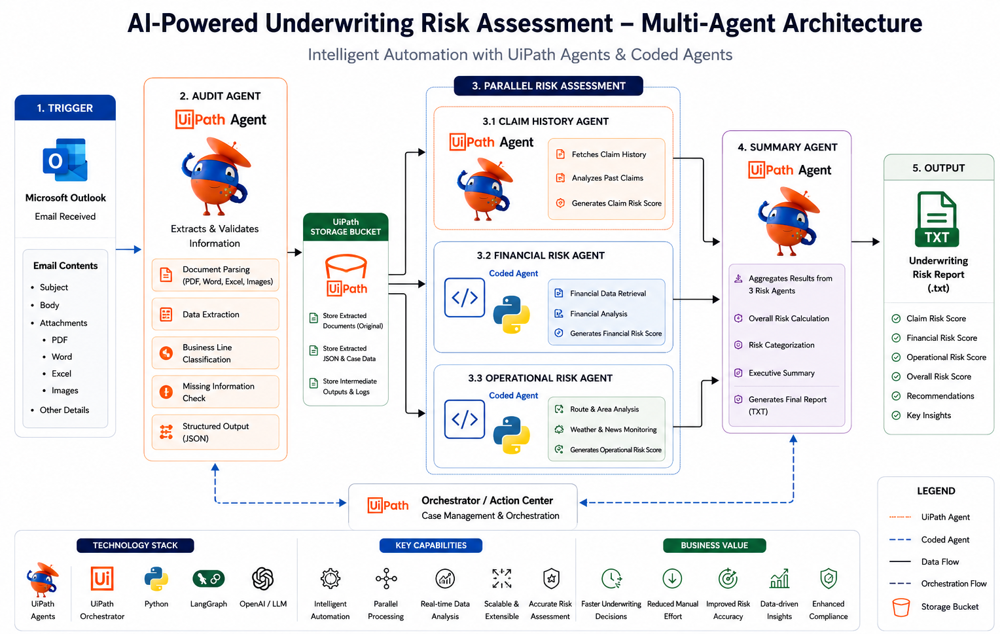

# InsureIQ

### AI-Powered Multi-Agent Underwriting Platform

> **UiPath AgentHack 2026 Submission**

InsureIQ is an AI-powered underwriting platform that combines UiPath Agent Builder, UiPath Coded Agents, and UiPath Maestro to automate the insurance underwriting process. Instead of relying on a single AI model, the platform distributes underwriting responsibilities across multiple specialized agents that collaborate to validate submissions, assess different dimensions of risk, and generate a comprehensive underwriting report for human review.

The solution demonstrates how low-code AI agents and coded AI agents can work together within the UiPath ecosystem to accelerate underwriting while ensuring that the final decision always remains with the underwriter.

---

# Table of Contents

- Overview
- Problem Statement
- Solution Overview
- Key Features
- System Architecture
- End-to-End Workflow
- UiPath Components Used
- Agent Types
- Technology Stack
- Multi-Agent Architecture
- Agent Overview
- Example Underwriting Case
- Prerequisites
- Installation & Setup
- Running the Solution
- External APIs
- Business Value
- Future Enhancements
- License

---
# Architecture at a Glance

The diagram below illustrates the complete underwriting workflow implemented in **InsureIQ**. The solution follows a three-stage architecture—**Ingestion**, **Research**, and **Review**—orchestrated using **UiPath Maestro**.

The Audit Agent receives and validates insurance submissions before creating a structured underwriting case. Three specialised agents then execute in parallel to analyse historical claims, financial health, and operational risks. Finally, the Summary Agent consolidates every assessment into a comprehensive underwriting report that is reviewed by the underwriter before the case is completed.

<p align="center">
    
</p>

---

## Workflow Summary

```text
Insurance Submission (Microsoft Outlook)
                │
                ▼
          Audit Agent
                │
                ▼
     UiPath Storage Bucket
                │
                ▼
═══════════════════════════════════════════
         Research Stage (Parallel)
═══════════════════════════════════════════

   Claim History Agent
          │

 Financial Risk Agent
          │

 Operational Risk Agent

═══════════════════════════════════════════

                │
                ▼
         Summary Agent
                │
                ▼
        Risk Report Form
                │
                ▼
          Cleaning RPA
                │
                ▼
 Final Underwriting Report (.txt)
```

---

## Agent Collaboration

Unlike traditional automation workflows where activities execute sequentially, InsureIQ distributes underwriting responsibilities across multiple specialised AI agents.

Each agent is responsible for a single business capability and communicates through **UiPath Storage Buckets** and **Case Management**, allowing multiple risk assessments to execute simultaneously without blocking one another.

This collaborative architecture provides:

- Faster underwriting turnaround
- Better scalability
- Clear separation of responsibilities
- Independent agent development
- Easier maintenance and testing
- Explainable decision-making
- Human-in-the-loop governance

---

# Overview

Insurance underwriting is one of the most critical processes within the insurance industry. Before a policy can be issued, underwriters need to review information from multiple sources, verify submitted documents, analyse financial stability, evaluate previous claims, understand operational risks, and finally determine whether the applicant represents an acceptable level of risk.

In many organisations, these activities are still performed manually. Underwriters spend a significant amount of time reading emails, reviewing attachments, comparing information across multiple documents, checking historical records, researching operational conditions, and preparing reports before they can even begin making an underwriting decision.

As submission volumes continue to increase, this manual approach leads to slower turnaround times, inconsistent assessments, higher operational costs, and unnecessary repetitive work.

InsureIQ was developed to simplify this process.

Instead of replacing the underwriter, InsureIQ acts as an intelligent underwriting assistant that automates repetitive investigation and analysis while ensuring that the final business decision remains under human control.

Using UiPath's agentic automation capabilities, the platform orchestrates multiple AI agents that collaborate to analyse different aspects of an insurance submission simultaneously before producing a consolidated underwriting assessment.

---

# Problem Statement

Modern insurance underwriting requires information from multiple independent sources before an informed decision can be made.

For every insurance submission, an underwriter typically needs to answer questions such as:

- Is the submission complete?
- Have all mandatory documents been provided?
- Are there any inconsistencies in the submitted information?
- Does the applicant have a poor claims history?
- Is the organisation financially stable?
- Are there operational or environmental risks associated with the insured asset?
- What is the overall underwriting risk?
- Should the application proceed for policy issuance?

Answering these questions often requires switching between multiple systems, manually reviewing documents, performing repetitive validations, and combining information from different sources into a final report.

This results in several operational challenges:

- Long underwriting turnaround times
- Manual document validation
- Repetitive data extraction
- Inconsistent risk assessments
- Increased operational costs
- Difficulty scaling underwriting teams
- Higher probability of manual errors
- Delayed policy decisions

---

# Our Solution

InsureIQ transforms underwriting into a collaborative multi-agent workflow.

Instead of assigning every responsibility to a single AI model, the platform divides the underwriting process into specialised tasks handled by independent AI agents.

Each agent focuses on one specific responsibility, allowing multiple analyses to run simultaneously while maintaining clear separation of responsibilities.

The workflow begins the moment an underwriting submission is received through Microsoft Outlook.

The Audit Agent validates the submission and extracts structured information from all supporting documents. Once validation is complete, three specialised research agents begin working in parallel:

- Claim History Agent
- Financial Risk Agent
- Operational Risk Agent

Each research agent independently evaluates a different dimension of underwriting risk before forwarding its findings to the Summary Agent.

The Summary Agent consolidates every assessment into a comprehensive underwriting report that is presented to the underwriter for review.

This approach significantly reduces manual effort while improving consistency, transparency, and decision-making speed.

---

# Key Features

- Automated underwriting submission intake
- Intelligent document validation
- AI-powered information extraction
- Parallel multi-agent risk assessment
- Historical claims analysis
- Financial risk assessment
- Operational risk analysis
- Consolidated underwriting report generation
- Human-in-the-loop review process
- Explainable AI recommendations
- Modular and scalable architecture
- UiPath-native orchestration

---

# Why InsureIQ?

Unlike traditional automation solutions that perform isolated tasks, InsureIQ combines intelligent agents into a coordinated underwriting workflow.

Each agent has a clearly defined responsibility and collaborates through UiPath Maestro, Storage Buckets, and Case Management.

This architecture provides several advantages:

- Faster underwriting decisions
- Reduced manual effort
- Consistent underwriting assessments
- Improved transparency
- Better utilisation of specialised AI agents
- Easy scalability for additional underwriting scenarios
- Human oversight throughout the decision-making process

---

# System Architecture

The underwriting workflow consists of three major stages orchestrated using UiPath Maestro.

## Stage 1 — Ingestion

The Audit Agent receives and validates every underwriting submission before any analysis begins.

Primary responsibilities include:

- Reading underwriting emails
- Extracting attachments
- Parsing documents
- Validating submissions
- Detecting missing information
- Generating structured JSON
- Creating the underwriting case

---

## Stage 2 — Research

After validation, three specialised agents begin working simultaneously.

These agents perform independent risk assessments:

- Claim History Agent
- Financial Risk Agent
- Operational Risk Agent

Because these analyses execute in parallel, overall processing time is significantly reduced.

---

## Stage 3 — Review

Once every research agent completes its assessment, the Summary Agent generates the final underwriting report.

The report is then presented to the underwriter for review through the Review Stage before the case is completed.

---

# High-Level Workflow

```

Microsoft Outlook

│

▼

Audit Agent

│

▼

UiPath Storage Bucket

│

▼

────────────────────────────────────────────

Research Stage (Parallel)

────────────────────────────────────────────

│

├── Claim History Agent

├── Financial Risk Agent

└── Operational Risk Agent

│

▼

Summary Agent

│

▼

Risk Report Form

│

▼

Cleaning RPA

│

▼

Final Underwriting Report (.txt)

```

---

# UiPath Components Used

The solution leverages multiple UiPath platform capabilities to build an end-to-end intelligent underwriting workflow.

| Component | Purpose |
|------------|---------|
| UiPath Maestro | End-to-end orchestration of the underwriting workflow |
| UiPath Agent Builder | Development of low-code AI agents |
| UiPath Coded Agents | Development of Python-based AI agents |
| UiPath Orchestrator | Execution and lifecycle management |
| UiPath Case Management | Case orchestration between workflow stages |
| UiPath Storage Buckets | Storage and sharing of structured underwriting data |
| UiPath Integration Service | Integration with Microsoft Outlook |
| UiPath AI Trust Layer | Secure communication with Large Language Models |
| UiPath Automation Cloud | Cloud platform hosting agents and workflows |

---

# Agent Types

InsureIQ combines both low-code AI agents and coded AI agents.

| Agent | Type | Technology |
|--------|------|------------|
| Audit Agent | Low-Code Agent | UiPath Agent Builder |
| Claim History Agent | Low-Code Agent | UiPath Agent Builder |
| Financial Risk Agent | Coded Agent | Python, LangGraph |
| Operational Risk Agent | Coded Agent | Python, LangGraph |
| Summary Agent | Low-Code Agent | UiPath Agent Builder |
# Technology Stack

InsureIQ combines UiPath's agentic automation platform with coded AI agents, external intelligence sources, and enterprise workflow orchestration to automate insurance underwriting.

| Category | Technologies |
|----------|--------------|
| Agent Development | UiPath Agent Builder, UiPath Coded Agents |
| Orchestration | UiPath Maestro, UiPath Orchestrator |
| Workflow Management | UiPath Case Management |
| Data Storage | UiPath Storage Buckets |
| AI Platform | UiPath AI Trust Layer |
| Programming | Python, JSON |
| AI Frameworks | LangGraph, LangChain, Pydantic |
| Document Processing | OCR, Intelligent Document Processing |
| Communication | Microsoft Outlook Integration |
| Weather Intelligence | Open-Meteo API |
| News Intelligence | Google News RSS, ReliefWeb API |
| Development Tools | Git, GitHub, Visual Studio Code |

---

# Multi-Agent Architecture

Unlike traditional automation where a single workflow performs every activity sequentially, InsureIQ adopts a collaborative multi-agent architecture.

Each AI agent is responsible for one well-defined business capability and works independently. This modular approach improves scalability, simplifies maintenance, and enables multiple underwriting activities to execute simultaneously.

The platform consists of five specialised agents:

- Audit Agent
- Claim History Agent
- Financial Risk Agent
- Operational Risk Agent
- Summary Agent

The Audit Agent prepares the underwriting case, the three research agents analyse different dimensions of risk in parallel, and the Summary Agent combines every finding into a final underwriting report.

---

# Agent Overview

## Audit Agent (Low-Code Agent)

The Audit Agent serves as the entry point for every underwriting submission.

Whenever an insurance submission is received through Microsoft Outlook, the Audit Agent automatically begins processing the case.

Its responsibilities include:

- Reading incoming underwriting emails
- Downloading supporting documents
- Extracting information from submitted files
- Validating mandatory underwriting fields
- Identifying missing information
- Detecting incomplete submissions
- Standardising extracted data
- Creating a structured underwriting case

Instead of forwarding raw documents to downstream systems, the Audit Agent converts the submission into a structured JSON format and stores it within the UiPath Storage Bucket.

Only validated submissions proceed to the Research Stage.

---

## Claim History Agent (Low-Code Agent)

Historical insurance claims often reveal behavioural patterns that are difficult to identify through financial statements alone.

The Claim History Agent analyses previous insurance claims associated with the applicant and evaluates historical risk.

The assessment includes:

- Previous claim records
- Claim frequency
- Claim severity
- Historical loss trends
- Recurring claim categories
- Repeated operational incidents

The generated output includes:

- Claim Risk Score
- Risk Category
- Historical observations
- Underwriting recommendation

---

## Financial Risk Agent (Coded Agent)

The Financial Risk Agent evaluates the financial strength of the insured organisation.

Unlike the Audit and Claim History Agents, this component is implemented as a UiPath Coded Agent using Python and LangGraph.

The agent analyses:

- Revenue trends
- Profitability
- Liquidity
- Debt obligations
- Cash flow
- Financial statements
- Business stability

The generated assessment helps determine whether financial conditions increase underwriting exposure.

Outputs include:

- Financial Risk Score
- Financial observations
- Financial recommendation

---

## Operational Risk Agent (Coded Agent)

The Operational Risk Agent evaluates operational exposure that may affect the insured asset.

For marine insurance, this includes analysing:

- Shipping routes
- Weather conditions
- Maritime news
- Port disruptions
- Conflict zones
- High-risk waterways
- Environmental conditions

External intelligence is collected from publicly available APIs before being analysed to generate an explainable operational assessment.

Outputs include:

- Operational Risk Score
- Route analysis
- Weather summary
- Operational observations
- Risk recommendations

---

## Summary Agent (Low-Code Agent)

The Summary Agent acts as the final AI decision-support layer.

Rather than calculating new risks, it consolidates findings generated by every research agent into a single underwriting report.

The report contains:

- Executive Summary
- Claim Assessment
- Financial Assessment
- Operational Assessment
- Overall Risk Category
- Key Findings
- Underwriting Recommendation

The completed report is then presented to the underwriter during the Review Stage.

---

# Example Underwriting Case

The following example demonstrates how a marine insurance submission moves through the complete underwriting workflow.

## Input

```json
{
  "company_name": "Navigator Holdings",
  "vessel_name": "Navigator Holdings",
  "origin_port": "Houston",
  "destination_port": "Singapore"
}
```

---

# Step 1 — Submission Received

An insurance submission arrives through Microsoft Outlook containing:

- Proposal Form
- Financial Statements
- Previous Claim Records
- Vessel Information
- Voyage Information

The Audit Agent automatically detects the new submission and initiates the underwriting workflow.

---

# Step 2 — Audit Agent

The Audit Agent validates the submission.

Activities performed include:

- Reading the email
- Extracting attached documents
- Identifying the line of business
- Verifying mandatory information
- Detecting missing documents
- Creating a structured underwriting case

Example Output

```json
{
  "company_name": "Navigator Holdings",
  "vessel_name": "Navigator Holdings",
  "origin_port": "Houston",
  "destination_port": "Singapore",
  "submission_status": "Validated"
}
```

The structured case is stored in the UiPath Storage Bucket.

---

# Step 3 — Parallel Research

Once validation is complete, three specialised agents begin working simultaneously.

### Claim History Agent

Result

```
Claim Risk Score : Medium

Historical Claims Reviewed : 4

Primary Concern : Cargo Damage
```

---

### Financial Risk Agent

Result

```
Financial Risk Score : Low

Financial Position : Stable

Liquidity : Healthy
```

---

### Operational Risk Agent

Result

```
Operational Risk Score : Medium

Route

Houston → Singapore

Weather

Normal

Operational Concerns

Moderate maritime exposure
```

---

# Step 4 — Summary Agent

The Summary Agent retrieves all completed assessments and generates the final underwriting report.

Example Summary

```
Navigator Holdings demonstrates stable financial
performance with manageable historical claims.

Operational analysis identifies moderate voyage-related
exposure associated with the Houston to Singapore route.

Overall underwriting risk is classified as Medium.

Recommendation

Proceed with underwriting while maintaining standard
operational monitoring throughout the voyage.
```

---

# Final Output

```
Company

Navigator Holdings

Claim History Risk

Medium

Financial Risk

Low

Operational Risk

Medium

Overall Risk

Medium

Recommendation

Proceed with underwriting under standard policy conditions.
```

---

# End-to-End Workflow

```
Microsoft Outlook

        │

        ▼

Audit Agent

        │

        ▼

UiPath Storage Bucket

        │

        ▼

Claim History Agent

Financial Risk Agent

Operational Risk Agent

        │

        ▼

Summary Agent

        │

        ▼

Risk Report Form

        │

        ▼

Cleaning RPA

        │

        ▼

Final Underwriting Report
```
# Prerequisites

Before running InsureIQ, ensure the following prerequisites are available.

### UiPath Platform

- UiPath Automation Cloud Account
- UiPath Maestro
- UiPath Agent Builder
- UiPath Studio
- UiPath Orchestrator
- UiPath Storage Buckets
- UiPath Case Management
- UiPath Integration Service

### Development Environment

- Python 3.12 or later (required for Coded Agents)
- Git
- Visual Studio Code (recommended)

### Python Dependencies

The Financial Risk Agent and Operational Risk Agent require the necessary Python dependencies specified in their respective projects.

Install the required packages before running the coded agents.

---

# Solution Structure

The solution consists of five specialised AI agents orchestrated through UiPath Maestro.

| Agent | Type | Responsibility |
|---------|------|----------------|
| Audit Agent | UiPath Agent Builder | Document intake, validation and structured data extraction |
| Claim History Agent | UiPath Agent Builder | Historical claims analysis |
| Financial Risk Agent | UiPath Coded Agent | Financial risk assessment |
| Operational Risk Agent | UiPath Coded Agent | Operational and voyage risk assessment |
| Summary Agent | UiPath Agent Builder | Consolidated underwriting report generation |

Each agent is independently responsible for a specific underwriting capability, making the platform modular, scalable and easy to extend.

---

# Getting Started

## Step 1 – Clone the Repository

Clone the repository using Git.

```bash
git clone https://github.com/<your-github-username>/InsureIQ.git
```

Navigate to the project directory.

```bash
cd InsureIQ
```

---

## Step 2 – Import UiPath Projects

Open UiPath Studio.

Import the following Agent Builder projects:

- Audit Agent
- Claim History Agent
- Summary Agent

Import the following Coded Agent projects:

- Financial Risk Agent
- Operational Risk Agent

Publish each project to UiPath Orchestrator.

---

## Step 3 – Configure UiPath Resources

Create the required UiPath resources.

- Storage Bucket
- Case Management Process
- Maestro Workflow
- Outlook Integration
- Required Assets
- Required Connections

Ensure every agent has access to the Storage Bucket for exchanging structured underwriting information.

---

## Step 4 – Configure External APIs

The Operational Risk Agent uses publicly available data sources.

Configure access for:

- Open-Meteo Weather API
- Google News RSS
- ReliefWeb API

No paid services are required.

---

## Step 5 – Publish the Agents

Publish every agent to your UiPath Automation Cloud tenant.

Verify that:

- Audit Agent is available
- Claim History Agent is available
- Financial Risk Agent is available
- Operational Risk Agent is available
- Summary Agent is available

---

## Step 6 – Execute the Workflow

Submit a new underwriting request through the configured Microsoft Outlook mailbox.

The workflow executes automatically.

The processing sequence is:

1. Audit Agent
2. Claim History Agent
3. Financial Risk Agent
4. Operational Risk Agent
5. Summary Agent
6. Review Stage
7. Cleaning RPA

The completed underwriting report is then available for review.

---

# External Services

The solution integrates with publicly available services to enrich underwriting decisions.

| Service | Purpose |
|----------|----------|
| Microsoft Outlook | Receive underwriting submissions |
| Open-Meteo API | Weather intelligence |
| Google News RSS | Maritime news |
| ReliefWeb API | Disaster and geopolitical intelligence |

---

# Screenshots

The following screenshots are included within the repository.

- High Level Architecture
- UiPath Maestro Workflow
- Audit Agent
- Claim History Agent
- Financial Risk Agent
- Operational Risk Agent
- Summary Agent
- Final Underwriting Report
- Review Stage
- End-to-End Workflow

---

# Business Value

InsureIQ demonstrates how AI agents can collaborate to modernise insurance underwriting without replacing the expertise of human underwriters.

The platform automates repetitive investigative tasks while ensuring that underwriting decisions remain transparent, explainable and human-supervised.

Key business benefits include:

- Reduced underwriting turnaround time
- Improved consistency across underwriting decisions
- Reduced manual document review
- Faster identification of operational risks
- Explainable AI recommendations
- Better utilisation of underwriter expertise
- Scalable multi-agent architecture
- Seamless integration with UiPath Automation Cloud

---

# Future Enhancements

The current implementation establishes the foundation for an extensible underwriting platform.

Potential future enhancements include:

- Fraud Detection Agent
- Regulatory Compliance Agent
- ESG Risk Assessment
- Catastrophe Intelligence
- Dynamic Premium Recommendation
- Reinsurance Analysis
- Portfolio Risk Monitoring
- AI Explainability Dashboard
- Predictive Claim Modelling
- Multi-line Insurance Support
- Enterprise Policy Administration System Integration

---

# Why We Built InsureIQ

Insurance underwriting is ultimately a decision-making process supported by information.

Today, much of that information is scattered across documents, historical records, public intelligence sources and operational data.

InsureIQ was built to demonstrate how a collaborative team of AI agents can gather, validate, analyse and summarise this information before presenting it to the underwriter in a clear and actionable format.

Rather than replacing human expertise, the platform augments it by eliminating repetitive analysis and allowing underwriters to focus on evaluating risk and making informed business decisions.

By combining UiPath Agent Builder, UiPath Coded Agents and UiPath Maestro into a single coordinated workflow, InsureIQ showcases how agentic automation can simplify one of the insurance industry's most complex processes.

---

# Contributors

Developed by

**Astitva Singh**

Built as part of **UiPath AgentHack 2026**.

---

# License

This project is licensed under the **MIT License**.

```
MIT License

Copyright (c) 2026 Astitva Singh

Permission is hereby granted, free of charge, to any person obtaining a copy
of this software and associated documentation files (the "Software"), to deal
in the Software without restriction, including without limitation the rights
to use, copy, modify, merge, publish, distribute, sublicense, and/or sell
copies of the Software, and to permit persons to whom the Software is
furnished to do so, subject to the following conditions:

The above copyright notice and this permission notice shall be included in all
copies or substantial portions of the Software.

THE SOFTWARE IS PROVIDED "AS IS", WITHOUT WARRANTY OF ANY KIND, EXPRESS OR
IMPLIED, INCLUDING BUT NOT LIMITED TO THE WARRANTIES OF MERCHANTABILITY,
FITNESS FOR A PARTICULAR PURPOSE AND NONINFRINGEMENT. IN NO EVENT SHALL THE
AUTHORS OR COPYRIGHT HOLDERS BE LIABLE FOR ANY CLAIM, DAMAGES OR OTHER
LIABILITY, WHETHER IN AN ACTION OF CONTRACT, TORT OR OTHERWISE, ARISING FROM,
OUT OF OR IN CONNECTION WITH THE SOFTWARE OR THE USE OR OTHER DEALINGS IN THE
SOFTWARE.
```

---

# Acknowledgements

We would like to thank the UiPath team for organizing AgentHack 2026 and providing the platform to explore how Agentic AI can be applied to real-world enterprise automation challenges.

---

⭐ If you found this project interesting, consider giving the repository a star and exploring the individual agent repositories to learn more about each component of the InsureIQ platform.